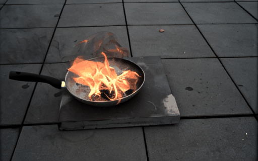

# TimeRewind: Rewinding Time with Image-and-Events Video Diffusion
Official code for paper TimeRewind: Rewinding Time with Image-and-Events Video Diffusion


**Please Read this Before Proceed**

This project is archived and incorporated as part of the final version accepted to CVPR 2025: Please check the paper and code release here:
# Repurposing Pre-trained Video Diffusion Models for Event-based Video Interpolation (CVPR 2025)
**Official repository for the CVPR 2025 paper, "Repurposing Pre-trained Video Diffusion Models for Event-based Video Interpolation"**

\[[Website](https://vdm-evfi.github.io/)\] 
\[[Paper](https://arxiv.org/abs/2412.07761)\] 


## Environment Setup

```
conda create -n TimeRewind python=3.9

conda activate TimeRewind

pip install -r requirements.txt

cd diffusers/

pip install -e ".[torch]"
```

## Demo Data and Model Checkpoints
1. Data: Last frame and event images pairs \
[Demo Data](https://drive.google.com/file/d/1OY3yjqq33ifuXBpy09ljIbl_jAdw1AbN/view?usp=drive_link)


1. Pre-trained Model Checkpoints \
[Model](https://drive.google.com/file/d/151OY394bNbBwEJdO0zcouX-ph-x9Aqua/view?usp=drive_link)


## Running Demo

```
./infer_demo.sh
```

please go to *infer_demo.sh* to change *-model_dir* to the path of downloaded Model_Demo, *--data_dir* to the path of downloaded Demo_data_release, and *--output_dir* to the path for saving the results

```
accelerate launch infer_demo.py \
    --model_dir='path_to_downloaded/Model_Demo' \
    --data_dir='path_to_downloaded/Demo_data_release' \
    --output_dir="path_to_save/Results/" \
    --width=512 \
    --height=320 \
```


The demo version of inference code and models are designed for the demo purpose only and for the ease of usage. 
The demo was tested on RTXA4000 GPU with Memory usage around 10GB, and with CPU with memory 32 GB. \

The expected results will be in *Results/test_images*





## To-do List
1. The inference code and model checkpoints  prepared for the demo purpose only will be released by 03/24/2024 (✅ Done)
2. Release of official training codes, data preparation codes, more data and more model checkpoints 


## Acknowledgements
- **Diffusers:** This code is built upon Diffuser code base

```bibtex
@misc{von-platen-etal-2022-diffusers,
  author = {Patrick von Platen and Suraj Patil and Anton Lozhkov and Pedro Cuenca and Nathan Lambert and Kashif Rasul and Mishig Davaadorj and Thomas Wolf},
  title = {Diffusers: State-of-the-art diffusion models},
  year = {2022},
  publisher = {GitHub},
  journal = {GitHub repository},
  howpublished = {\url{https://github.com/huggingface/diffusers}}
}
```

- **BS-ERGB dataset:** The demo data are from the test set of BS-ERGB dataset
```bibtex
@Article{Tulyakov22CVPR,
  author        = {Stepan Tulyakov and Alfredo Bochicchio and Daniel Gehrig and Stamatios Georgoulis and Yuanyou Li and
                  Davide Scaramuzza},
  title         = {{Time Lens++}: Event-based Frame Interpolation with Non-linear Parametric Flow and Multi-scale Fusion},
  journal       = "IEEE Conference on Computer Vision and Pattern Recognition",
  year          = 2022
}
```


